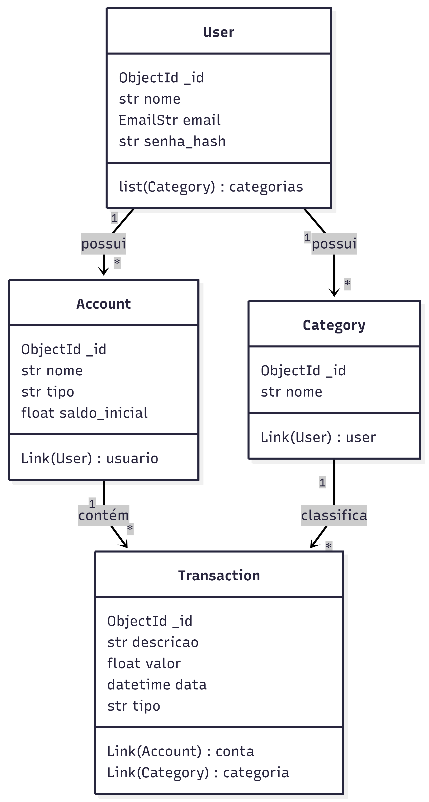

# fastapi-beanie-finance
API de Gestão Financeira e Controle de Gastos Assíncrona desenvolvida com FastAPI, MongoDB e Beanie ODM.

## Tecnologias
FastAPI para construção da API
Persistência de dados no MongoDB usando driver assíncrono.
Suporte para MongoDB como banco de dados NoSQL
UV como gerenciador de dependências
Benie como ODM compatível com o Pydantic

## A API implementa
Consultas Requeridas: A API deve implementar consultas diversificadas e úteis ao contexto escolhido.

a) Consultas por ID
b) Listagens filtradas por relacionamentos
c) Buscas por texto parcial e case-insensitive.
d) Filtros por data/ano utilizando consultas baseadas em operadores do MongoDB
e) Agregações e contagens utilizando aggregation pipeline
f) Classificações e ordenações
g) Consultas complexas envolvendo múltiplas coleções

## Preparando ambiente Mongo
1) Instale o MongoDB Compass (GUI)
2) Crie sua conta no MongoDB Atlas (versão gratuita que hospeda em nuvem)

## Preparando seu projeto python 3.13
Repare que para esse projeto usamos UV como gerenciador de pacotes.
Iniciar o projeto, fixar a versão python e instalação de dependências:

## Elaboração de diagramas utilizando o Mermaid 

classDiagram
    class User {
        ObjectId _id
        str nome
        EmailStr email
        str senha_hash
        list(Category) categorias
    }
    
    class Category {
        ObjectId _id
        str nome
        Link(User) user
    }
    
    class Account {
        ObjectId _id
        str nome
        str tipo
        float saldo_inicial
        Link(User) usuario
    }
    
    class Transaction {
        ObjectId _id
        str descricao
        float valor
        datetime data
        str tipo
        Link(Account) conta
        Link(Category) categoria
    }
    
    User "1" --> "*" Category : possui
    User "1" --> "*" Account : possui
    Account "1" --> "*" Transaction : contém
    Category "1" --> "*" Transaction : classifica


 #iamgem do diagrama

```bash
uv init
uv python pin 3.13
uv add fastapi uvicorn "motor[srv]" beanie pydantic-settings
```

Lê o seu arquivo pyproject.toml, consulta uv.lock e instala o que está faltando na sua .venv:

```bash
uv sync
uv venv
source .venv/bin/activate
```


